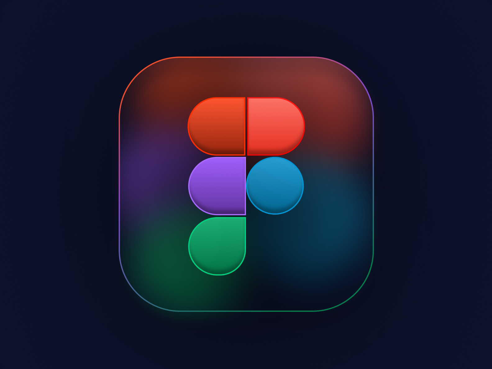

# HTTP-5106 - Intro to Design for Interaction

Welcome to the HTTP-5106 Intro to Design for Interaction repository! This repository contains all assignments, lab exercises, and practice files related to the course, focusing on creating engaging and user-friendly designs.

## Design Resources

To start designing, explore the following resources:

- [Figma - Design and Prototyping Tool](https://www.figma.com/)  

Figma allows you to create and collaborate on designs in real time.

> *Note:* Enhance your Figma skills with this resource Figma Tutorials.

### JavaScript Code Example

Here’s a simple JavaScript code snippet that creates an array of design tools and logs each tool to the console:

javascript
const designTools = ["Figma", "Sketch", "Adobe XD", "InVision"];

designTools.forEach(tool => {
    console.log(`Design Tool: ${tool}`);
});
